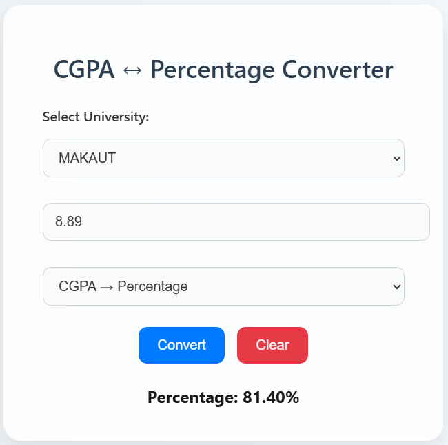

# GradeSync – CGPA ↔ Percentage Converter

GradeSync is a simple and user-friendly web application that helps students convert **CGPA to Percentage** and **Percentage to CGPA** based on the conversion rules of different universities across India.

One of the biggest challenges students face is that every university follows its own conversion formula. GradeSync brings these rules together in one place, making the conversion process quick, accurate, and hassle-free.

🌐 **Live Demo:** https://gradesync.netlify.app/

---

## ✨ Features

- Convert **CGPA to Percentage**
- Convert **Percentage to CGPA**
- Supports multiple university-specific conversion formulas
- Clean and responsive user interface
- Fast, lightweight, and mobile-friendly
- Instant conversion results
- Easy to use and accessible from any device

---

## 🎯 Why GradeSync?

Students often need CGPA or Percentage conversions while applying for jobs, internships, higher studies, scholarships, or competitive exams. Since different universities follow different conversion methods, finding the correct formula can be confusing.

GradeSync simplifies this process by providing a unified platform that supports multiple university-specific conversion rules, helping students get accurate results in seconds.

---

## 🛠️ Tech Stack

- **HTML5**
- **CSS3**
- **JavaScript (ES6)**

---

## 🚀 Future Improvements

- Support for additional universities and grading systems
- GPA ↔ CGPA conversion support
- Conversion history tracking
- University search and filtering
- Dark mode support
- Progressive Web App (PWA) support

---

##  Contributing

Suggestions, improvements, and contributions are always welcome. Feel free to fork the repository and submit a pull request.

---

